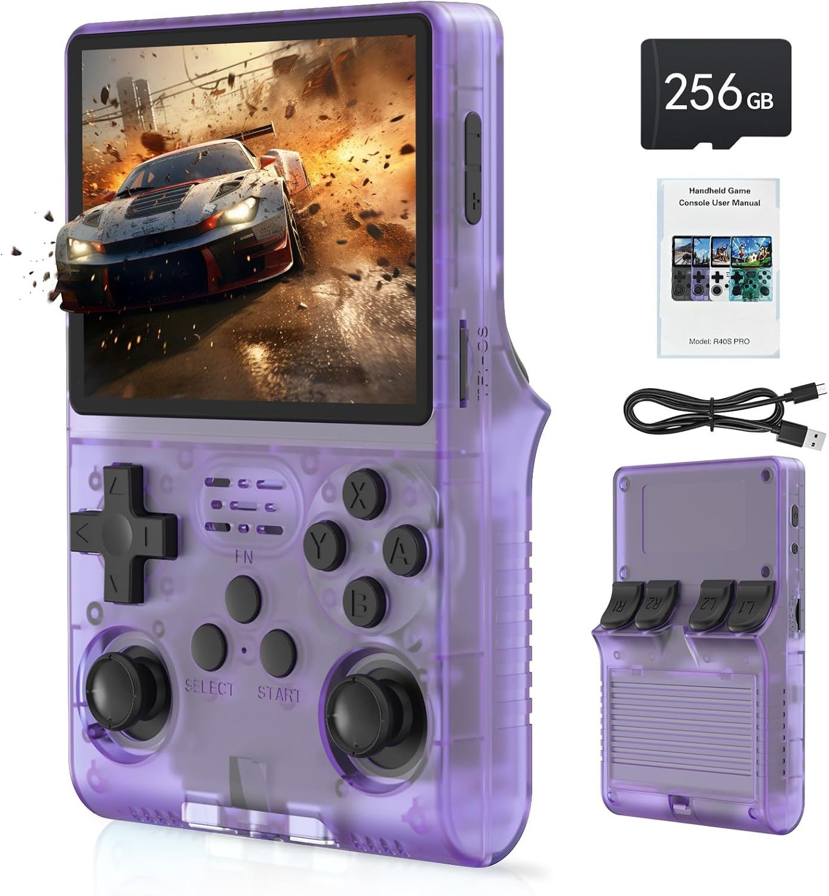

---
hide:
  - navigation
  - toc
---

For more information about these devices visit following sites:

[Handhelds Google Spreadsheet](https://docs.google.com/spreadsheets/d/1irg60f9qsZOkhp0cwOU7Cy4rJQeyusEUzTNQzhoTYTU/edit?gid=0#gid=0)

[Joey's Retro Handhelds List](https://joeysretrohandhelds.com/handheld-list/)

[r/SBCGaming - Reddit SBC (Single Board Computers) Gaming & Retro Handhelds](https://www.reddit.com/r/SBCGaming/)

## Sortable Table of Handheld Devices with the RK3326 SoC

| Brand                                | Name                 | Image | Release   |Display|Resolution|Aspect Ratio|Firmware|Notes|
|--------------------------------------|----------------------|-------|-----------|-------|-------|-----------|-------|----|
| HardKernel  | Odroid Go Advance|| 2020 / 02 |3.5 inch| 480 x 320|3:2|ArkOS - ROCKNIX - JelOS - Batocera - EmuELEC - Recalbox - Lakka||
| Bittboy / Miyoo / Wolsen (RetroMiMi)| RK2020|| 2020 / 06 |3.5 inch|480 x 320|3:2|ArkOS - Batocera||
| PowKiddy | PowKiddy RGB10|        | 2020 / 07 |  3.5inch|480 x 320|3:2|ArkOS - Batocera|<a href='https://github.com/christianhaitian/rgb10/wiki'>RGB10 WIKI</a>|
|Game Kiddy / Lao Zhang | Z-Pocket Game Pro|| 2020 / 08 | 3.5 inch|480 x 320|3:2|||
|Anbernic | RG-351P|| 2020 / 09 |3.5 inch|480 x 320|3:2|AmberELEC - ROCKNIX - Batocera - Recalbox - Lakka - TheRA - UnofficialOS||
|PowKiddy | PowKiddy RGB20|| 2020 / 11 | 3.5 inch| 480 x 320|3:2|ArkOS - EmuELEC|     |
|Anbernic| RG-351M|| 2021 / 01 |3.5 inch| 480 x 320|3:2|ArkOS - AmberELEC - ROCKNIX - Batocera - Recalbox - Lakka - UnofficialOS||
|HardKernel  | Odroid Go Super |       | 2021 / 01 |5.0 inch       | 854 x 480    |16:9|ROCKNIX - Batocera - EmuELEC - Recalbox - Lakka - RetroOZ||
|Anbernic  | RG-351V|| 2021 / 03 | 3.5 inch|640 x 480|4:3|ArkOS - AmberELEC - ROCKNIX - Recalbox - Lakka - TheRA - UnofficialOS||
| PowKiddy  | PowKiddy RGB10 Max|       | 2021 / 04 | 5.0 inch |854 x 480 |16:9|Batocera - RetroOZ - EmuELEC - 351DROID||
|GameForce | GameForce Chi|| 2021 / 05 |3.45 inch| 640 x 480 |4:3|ArkOS - Batocera - EmuELEC - Lakka - TheRA||
|Anbernic  | RG-351MP|       | 2021 / 09 | 3.5 inch|640 x 480|4:3|ArkOS - AmberELEC - Lakka - TheRA - UnofficialOS||
| PowKiddy| PowKiddy RGB10 Max 2 || 2021 / 10 | 5.0 inch |854 x 480 |16:9|Batocera - RetroOZ - EmuELEC - 351DROID||
| PowKiddy| PowKiddy RGB10S|| 2022 / 03 |3.5 inch |480 x 320 |3:2|ArkOS ||
| PowKiddy| PowKiddy RGB20S|| 2022 / 05 |3.5 inch|640 x 480|4:3|ArkOS - AmberELEC - TheRA - UnofficialOS||
|SZDiiER| D-007|| 2023 / 05 |3.5 inch|640 x 480|4:3|AmberELEC||
|Game Console| R35S|| 2023 / 07 |3.5 inch|640 x 480|4:3|ArkOS - AmberELEC - ROCKNIX - Lakka - UnofficialOS |<a href='https://github.com/manster-zz/R36S-LINKS/wiki'>R36S WIKI</a>|
|Game Console| R36S|| 2023 / 10 | 3.5 inch|640 x 480|4:3|ArkOS - AmberELEC - ROCKNIX - Lakka - UnofficialOS|R35S with swapped button layout - <a href='https://github.com/manster-zz/R36S-LINKS/wiki'>R36S WIKI</a>|
|Ampown| XU10|| 2023 / 11 |3.5 inch|640 x 480|4:3|AmberELEC - ROCKNIX|RK3326S |
|GameMT| GameMT E6|| 2023 / 12 |5.0 inch |854 x 480 |16:9|cHAos||
|Game Console| R33S|       | 2024 / 01 |3.5 inch|640 x 480|4:3|ArkOS - AmberELEC - ROCKNIX - Lakka - UnofficialOS|R35S/R366S in a Miyoo Mini+ shell - <a href='https://github.com/manster-zz/R36S-LINKS/wiki'>R36S WIKI</a> |
| PowKiddy| PowKiddy V10|| 2024 / 06 |3.5 inch |480 x 320 |3:2|ArkOS ||
|Game Console|R40S Pro|| 2024 / 07|3.5 inch|640 x 480|4:3|ArkOS - AmberELEC - ROCKNIX - Lakka - UnofficialOS|R36S in a different shell (rounded bottom)|
|           | O30s|       | 2024 / 07 |3.5 inch|640 x 480|4:3|ArkOS|Says "R30S" on the board|
| Gaminja/Kinhank| K36|       | 2024 / 07 |3.5 inch|640 x 480|4:3|||

