# Devices

## Sortable Table of Handheld Devices with the RK3326 SoC

| Brand                                | Name                 | Image | Release   | Notes |
|--------------------------------------|----------------------|-------|-----------|-------|
| HardKernel                           | Odroid Go Advance    |<a href='assets/1.jpg'>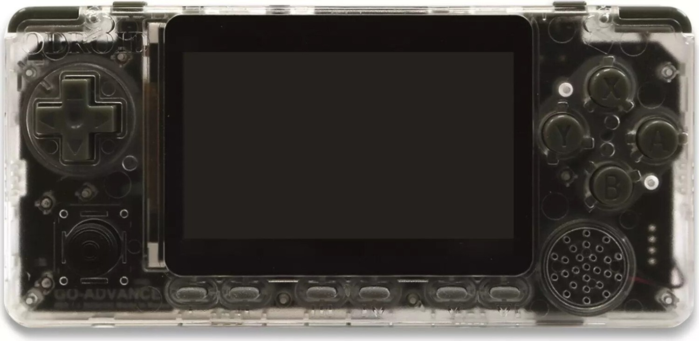</a>       | 2020 / 02 |       |
| Bittboy / Miyoo / Wolsen (RetroMiMi) | RK2020               |        | 2020 / 06 |       |
| PowKiddy                             | PowKiddy RGB10       |<a href='assets/3.jpg'>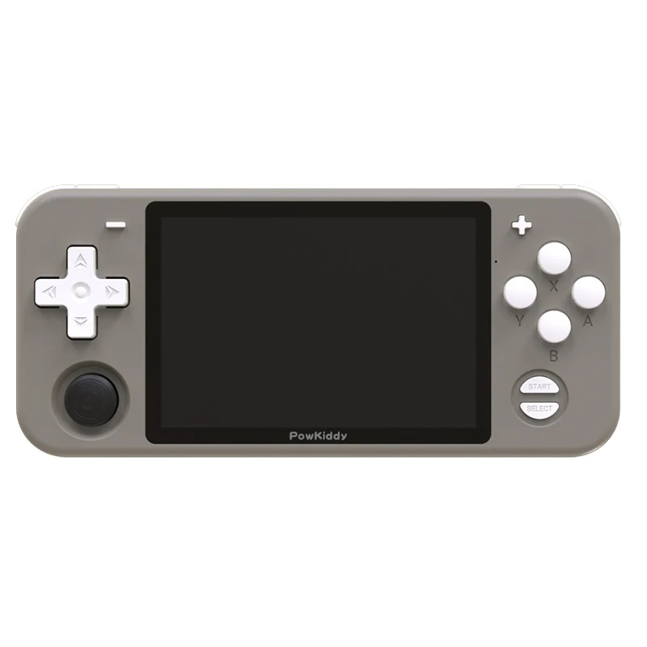</a>        | 2020 / 07 |       |
|Game Kiddy / Lao Zhang                | Z-Pocket Game Pro    |<a href='assets/device-zpocketgamepro.png'>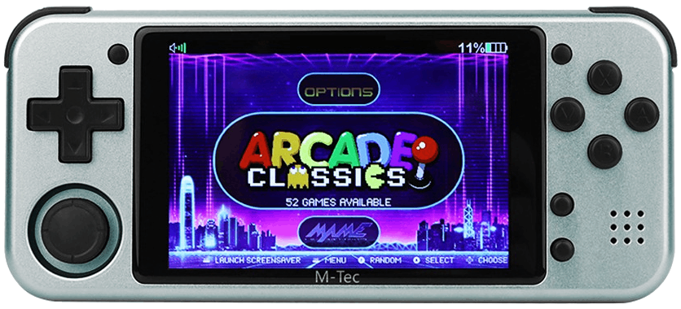</a>       | 2020 / 08 |       |
|Anbernic                                      | RG-351P              |<a href='assets/351p_e776ee05-a96c-45c2-bc31-e40f07fa92f6.webp'>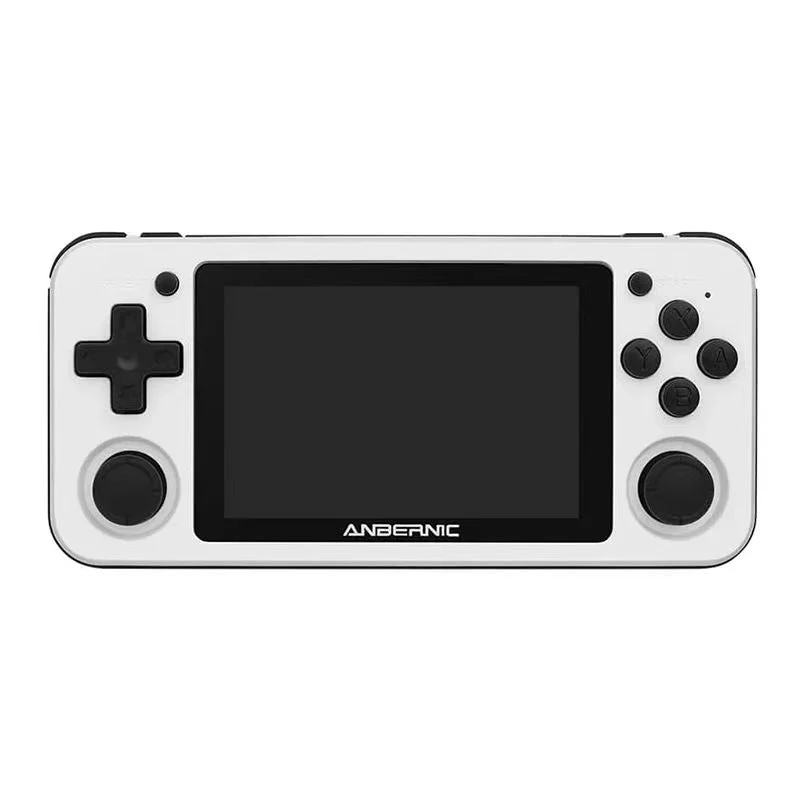</a>       | 2020 / 09 |       |
|PowKiddy                                      | PowKiddy RGB20       |<a href='assets/61DcNDaOF4L._AC_SX679_.jpg'>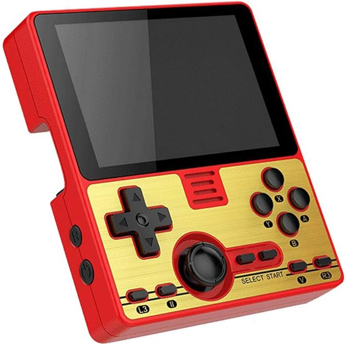</a>       | 2020 / 11 |       |
|Anbernic                                      | RG-351M              |<a href='assets/351m_811201ca-20db-42d8-8ee1-4e5e9947f7f2.webp'>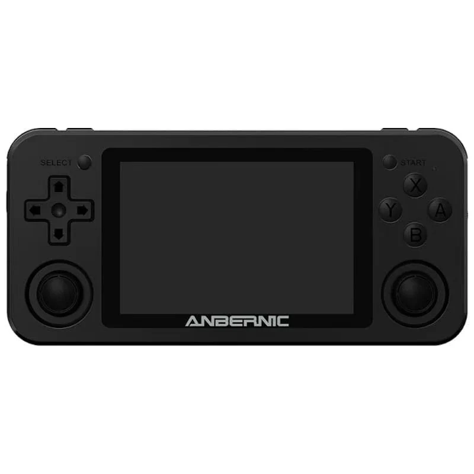</a>       | 2021 / 01 |       |
|HardKernel                                      | Odroid Go Super      |<a href='assets/odroid-go-super-tragbare-spielkonsole-clear-white.webp'>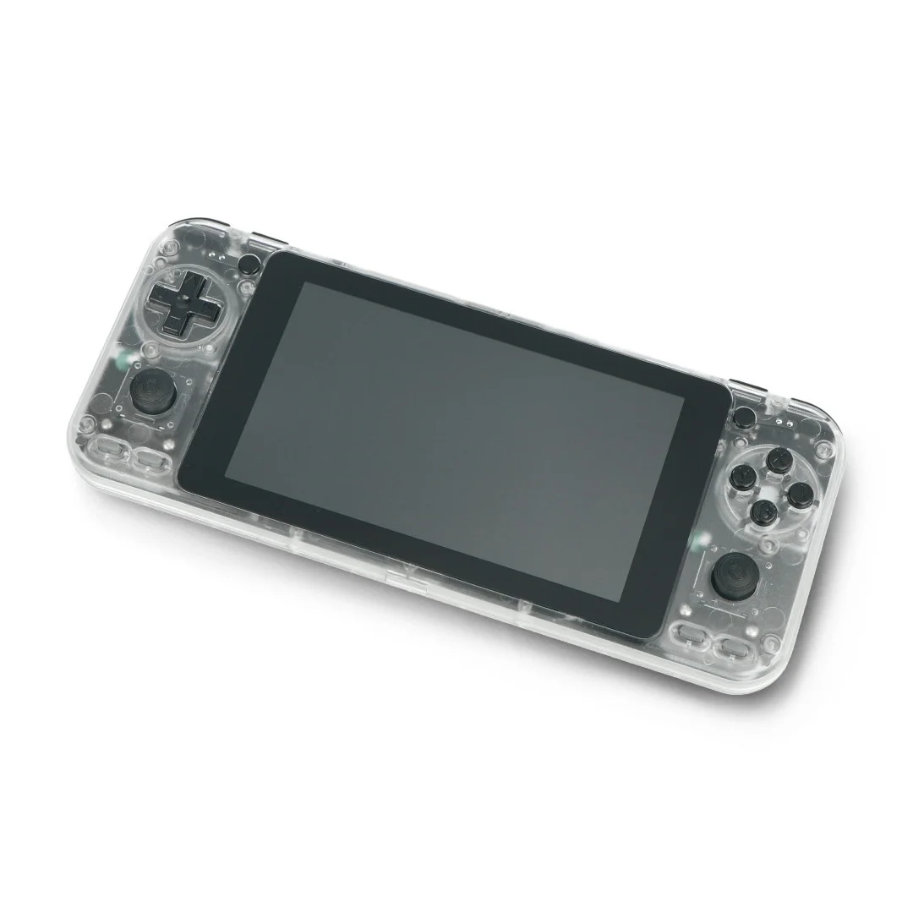</a>       | 2021 / 01 |       |
|Anbernic                                      | RG-351V              |       | 2021 / 03 |       |
| PowKiddy                             | PowKiddy RGB10 Max   |       | 2021 / 04 |       |
|GameForce                                     | GameForce Chi         |       | 2021 / 05 |       |
|Anbernic                                      | RG-351MP             |<a href='assets/351mp.webp'>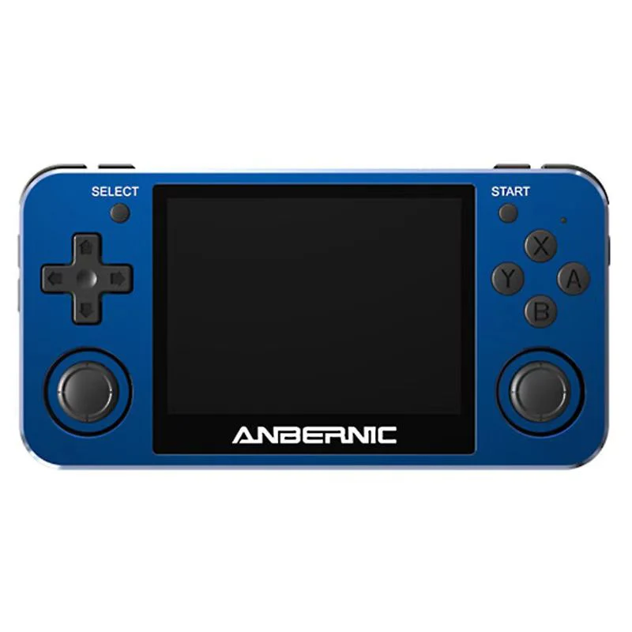</a>       | 2021 / 09 |       |
| PowKiddy                    | PowKiddy RGB10 Max 2 |       | 2021 / 10 |       |
| PowKiddy                    | PowKiddy RGB10S      |       | 2022 / 03 |       |
| PowKiddy                    | PowKiddy RGB20S      |       | 2022 / 05 |       |
|SZDiiER                               | D-007                |<a href='assets/d-007.webp'>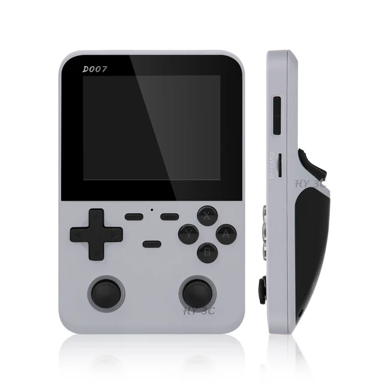</a>       | 2023 / 05 |       |
|Game Console                                      | R35S                 |<a href='assets/r35s.webp'>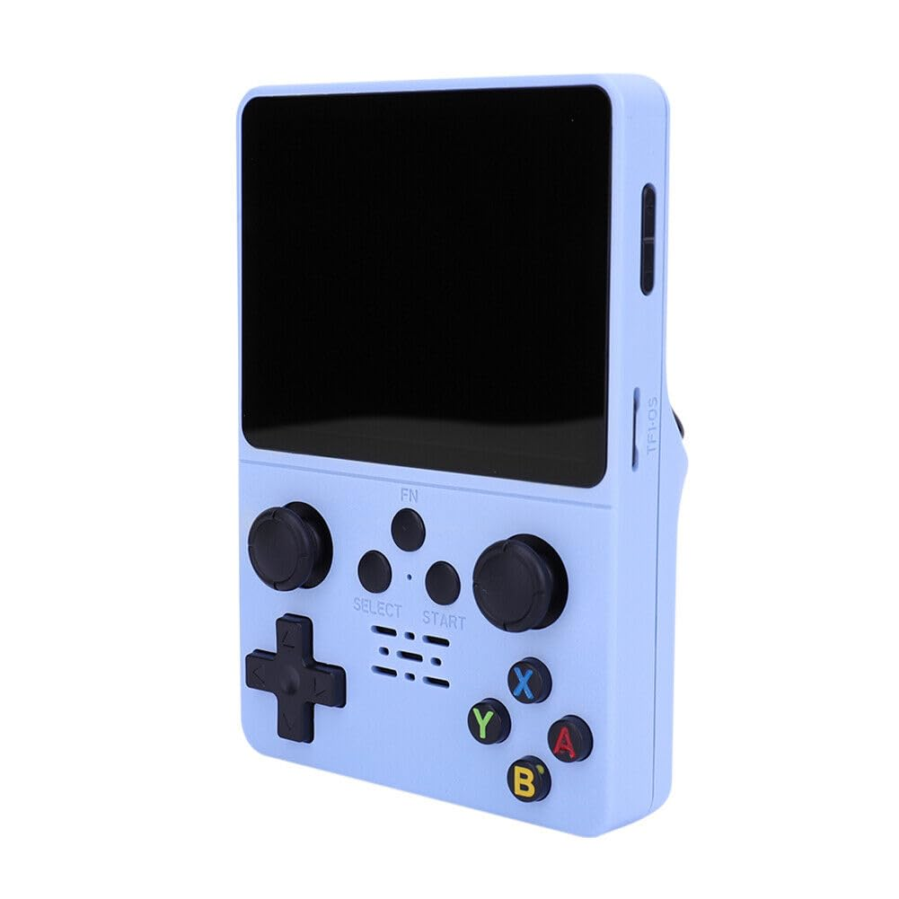</a>       | 2023 / 07 |       |
|Game Console                                      | R36S                 |<a href='assets/R36S.jpg'>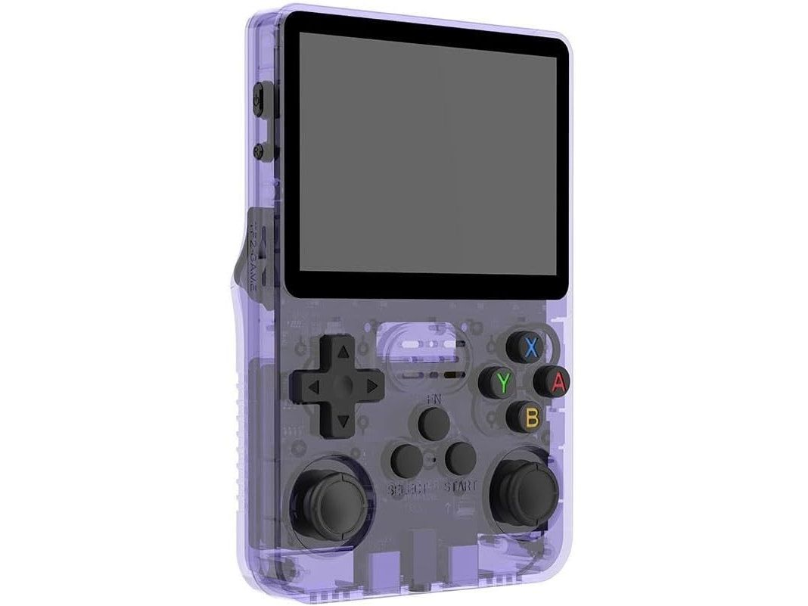</a>       | 2023 / 10 |       |
|Ampown                                      | XU10                 |<a href='assets/XU10.jpg'>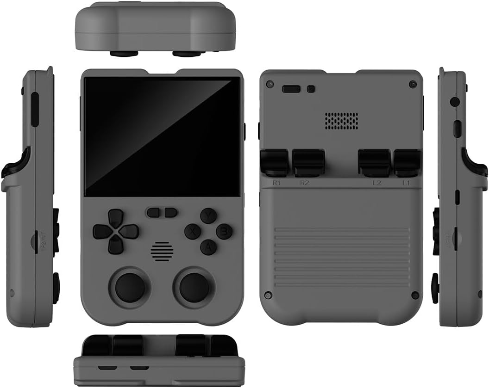</a>       | 2023 / 11 |       |
|GAMENT                                      | GAMEMT E6            |       | 2023 / 12 |       |
|Game Console                                      | R33S                 |<a href='assets/R33S.webp'>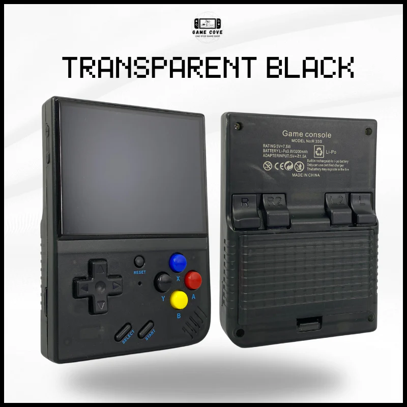</a>       | 2024 / 01 |       |
| PowKiddy                             | PowKiddy V10         |       | 2024 / 06 |       |
|                                      | O30s                 |<a href='assets/O30s.webp'>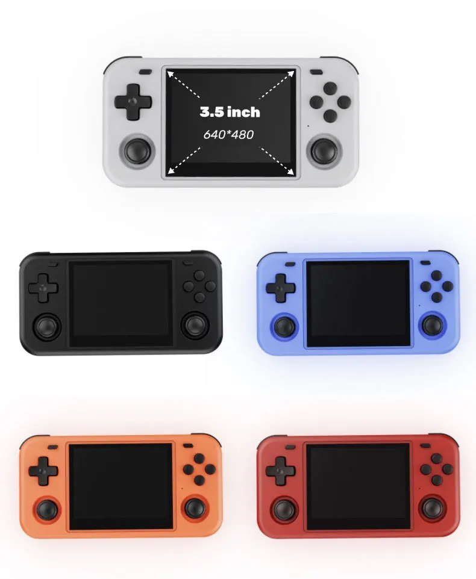</a>       | 2024 / 07 |       |
| Gaminja                              | K36                  |<a href='assets/k36.webp'>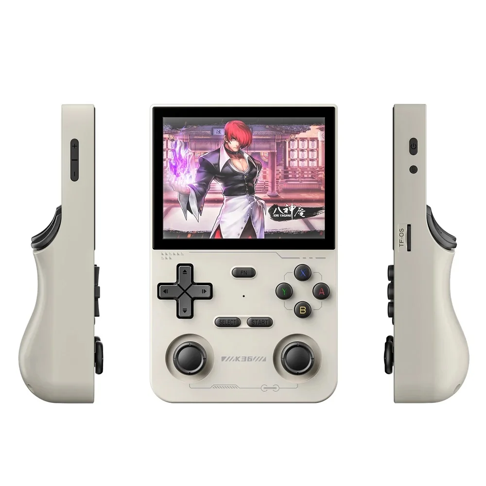</a>       | 2024 / 07 |       |
| PowKiddy                             | Powkiddy RGB20 Pro   |       | ?         |       |
|                                      |                      |       |           |       |
